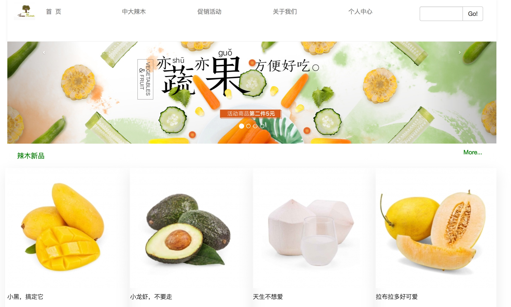
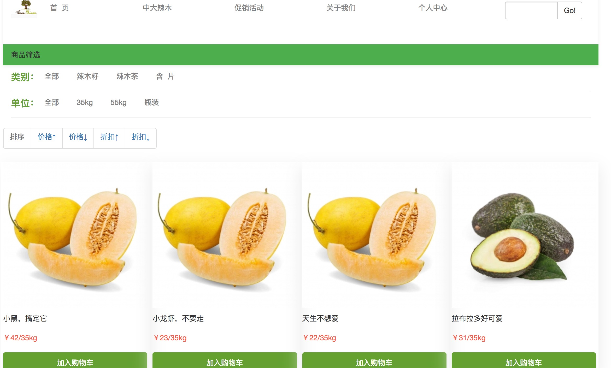
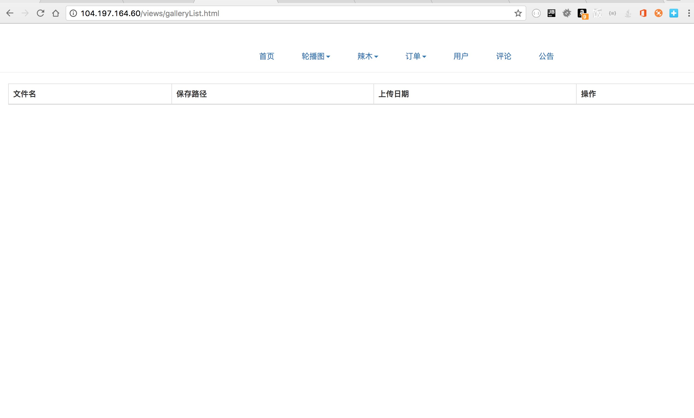
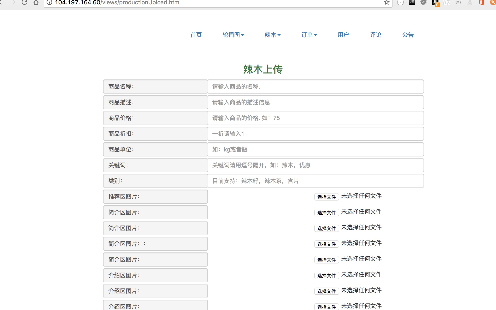

# lamu-dubbo-client
辣木dubbo客户端
# lamu-dubbo-client
辣木dubbo客户端
## 辣木dubbo客户端简介
----
> 1.辣木dubbo客户端，其实是一个web电商平台，采用的是oto的形式，支持线下体验，线上下单。同时可以在线注册网站，浏览商品，在线购买,留言，评价以及个人中心
等服务。可以说是一个简单版的在线电子商务平台，主要以辣木为产品进行销售。 
-----
> 2.该网站的初衷是答应了朋友给她免费提供一个在线销售辣木的平台，最初设计和搭建这个平台是在2016年2月份，从最初的有着冲动的想法到慢慢去实现，
然而年少无知，也没有耐力，最后还是食言了，没有坚持下去，最后一次的更新是在9个月前，那时候刚刚集成了dubbo服务，虽然还不够完善。直到现在想重新架构一次，
才决定从SourceForge上迁移过来，主体的业务保持不变，但架构上从最初的简单一体架构变成了分布式。慢慢融入了自己的一些想法。 
----
> 3.辣木电商的主体架构
目前主要采用为dubbo的形式，目标是做一个分布式的业务，client为web项目，集成了dubbo和zookeepr进行服务的远程拉取，期间集成了redis，但是项目改动期间
又将其去掉了，后续会加上。lamu-dubbo为辣木服务端，提供dubbo服务，
该模块向zookeeper中注册服务，没有使用监控中心。在数据库orm框架上选择采用mybatis并且集成了genertor插件，之所以采用这个东西在于方便快捷。
数据库采用mysql，不用多说。现有的机子为两台腾讯云主机，一台腾讯云数据库，其中一台做为web项目，并部署dubbo服务，另外一台主机部署zookeepr和dubbo服务，
数据库单独部署，因此后期可以做成分布式和集群的，这样可以提高业务的健壮性。
----
## 后期要做的
> 1.分布式系统的部署，后期会将服务做成分布式和集群
> 2.redis缓存和ehcache缓存的加入，暂时会考虑将redis作为token key或者部署ID缓存，而ehcache作为mybatis缓存
> 3.redis发布订阅系统的加入，之前就做过，版本更新的过程中去掉了，暂时考虑用来做公告信息和消息订阅以及应用在下单系统
> 4.elasticSearch 搜索系统的加入，目前已经在其他的项目中应用到了搜索引擎的业务，主要用于财务统计模块，后期会将ES加入作为全文搜索和财务统计
> 5.支付宝和微信支付接入，考虑到个人网站没有工商备案，因此会采用第三方接入平台
----
## 使用
> 1.下载项目到idea中，修改dubbo配置文件的zookeeper地址，指向你自己的注册中心和端口。然后编译部署到tomcat中启动即可。
## 联系
> 1.该项目完全作为demo和学习使用，不具备任何线上盈利能力。因此如果有任何疑问可以致电：+1 5162091310 邮箱：slsongliang@gmail.com
## 预览

